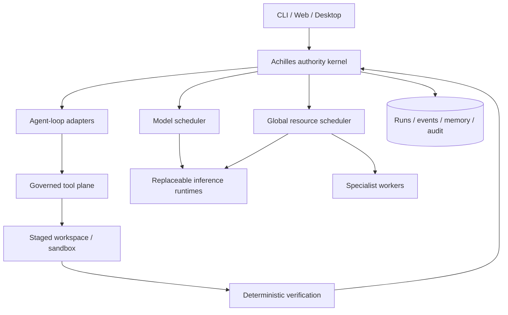

# Achilles

<div align="center">

**A hardware-aware, local-first AI kernel where the model is a component—not the system.**

[](https://github.com/Priyam1713/Achilles/actions/workflows/ci.yml)
[](https://github.com/Priyam1713/Achilles/actions/workflows/codeql.yml)
[](https://www.python.org/)
[](LICENSE)
[](#project-status)

</div>

Achilles is an open-source control plane for capable local AI systems. It keeps policy,
identity, approvals, durable state, resource arbitration, tool execution, verification and
audit outside the model so models, runtimes, agent harnesses and memory systems can compete
without taking ownership of the machine.

```text
THE MODEL IS A COMPONENT. THE KERNEL IS THE SYSTEM.
```

Achilles is built for people who want local models to do real work—not just chat—without
turning whichever agent framework is fashionable this month into a permanent security and
architecture boundary.

> [!WARNING]
> Achilles is pre-alpha research software that can execute model-proposed actions. Use
> disposable workspaces, review approvals, keep backups, and read the
> [security model](docs/SECURITY.md) before granting write, shell, network or credential
> capabilities.

## Why Achilles

- **Authority stays outside the model.** Fail-closed policy, scoped capability grants,
  explicit approvals and post-condition verification decide what actually happens.
- **Local-first and replaceable.** llama.cpp today; alternative inference engines, model
  routers, harnesses, memory layers and specialist workers sit behind adapters.
- **Hardware is part of the architecture.** GPU leases, residency decisions, model
  load/unload and measured local benchmarks prevent imaginary capacity planning.
- **Durable work, not ephemeral chat.** Jobs, runs, checkpoints, workflows, replay,
  collaboration events and tamper-evident audit records survive process boundaries.
- **Evidence before promotion.** Challengers run the same tasks under the same constraints.
  Discovery, benchmarking and promotion are deliberately separate operations.
- **Honest capability accounting.** Installed, reachable, implemented and locally proven are
  different states, tracked in the repository instead of collapsed into a feature claim.

## Architecture



The kernel owns the final state transition. Harnesses, models, tools, memory services and
telemetry return untrusted evidence; none of them can authorize themselves. See the
[architecture](docs/ARCHITECTURE.md), [security boundary](docs/SECURITY.md), and
[tournament design](docs/TOURNAMENT_ARCHITECTURE.md).

## What works today

| Plane | Current implementation |
| --- | --- |
| Authority | Policy engine, capability grants, approvals, local authentication, provenance and append-only audit events |
| Agency | Native tool-calling loop plus Pi, OpenCode and Goose adapters; context compaction, hooks, subtasks and deterministic replay |
| Tools | Governed file operations, search, shell execution, specialists, media, memory and web search with contextual discovery |
| Durability | Jobs, immutable run attempts, checkpoints, workflow DAGs, recurring triggers, transactions and restart recovery primitives |
| Resources | Cross-process GPU/workspace leases, residency management, scheduling and telemetry |
| Memory | Lexical, vector and graph stores with provenance and project-scope filtering |
| Collaboration | Rooms, identities, threads, mentions, reactions, shared canvases, mailbox and derived presence |
| Interfaces | CLI, authenticated local API, web control surface and an early Tauri desktop client |
| Evaluation | Local benchmark database, versioned harness suites, isolated held-out verification, runtime tournaments and explicit non-promoting scorecards |

The detailed truth—including incomplete and unreachable capabilities—is maintained in
[Implementation Status](docs/IMPLEMENTATION_STATUS.md), and the reproducibility and
verification rules are in the [benchmark contract](docs/BENCHMARKS.md). In particular, browser/desktop
control has an interface but no production controller, several specialist workers still
return `501`, and streaming is not implemented.

## Quick start for contributors

You can develop and run the kernel test suite without a GPU or downloading model weights.

```bash
git clone https://github.com/Priyam1713/Achilles.git
cd Achilles
uv sync --extra dev
uv run pytest -q
uv run ruff check .
```

Requirements:

- Python 3.11 or newer; Python 3.12 is the primary development version
- [uv](https://docs.astral.sh/uv/) for locked environment management
- Windows 11 + WSL2 Ubuntu 24.04 for the currently proven full workstation path
- NVIDIA CUDA for local GPU inference; CPU-only kernel development remains supported

## Build a local workstation

The bootstrap is intentionally separate from the lightweight development setup because
model and specialist artifacts are large. From PowerShell:

```powershell
git clone https://github.com/Priyam1713/Achilles.git
cd Achilles
Set-ExecutionPolicy -Scope Process Bypass
$env:HF_TOKEN="YOUR_TOKEN_IF_NEEDED"
./Install.ps1
```

The default `core` profile targets coding, retrieval, documents and speech. Run the physical
storage and port preflights before downloading anything; sparse WSL2 VHDX capacity can be
much larger than the free space on its Windows backing volume.

```powershell
uv run python scripts/verify_host.py --check-ports
wsl bash -lc 'source scripts/runtime_env.sh && scripts/verify_storage.sh "$SOAI_DATA_HOME" core'
```

The installer does not accept gated model licences for you. Model weights are downloaded
from their upstream projects and are not part of this repository or its Apache-2.0 licence.
See [Local Build](docs/LOCAL_BUILD.md) and [Windows](docs/WINDOWS.md) before using the much
larger `workstation` profile.

## Give Achilles a task

The fastest development path starts only the proven llama.cpp + Qwen3.5-9B + native-agent
stack, authorizes the selected workspace for one hour, and immediately runs the task:

```powershell
.\Use.ps1 "fix the failing tests and explain the change" -Workspace C:\path\to\your\project
```

This is the provisional development profile: Qwen3.5-9B for fast/smart coding, governed
native tools, and local execution. The heavier Qwen3.8-27B remains available through
`--mode deep`. Native is the measured default after a 24/24 held-out SWE result; the
[selection report](docs/HARNESS_SELECTION.md) records Pi, Goose and OpenCode performance.

The equivalent explicit commands are:

```powershell
uv run sovereign workspace add C:\path\to\your\project
uv run sovereign grant cli-operator write workspace --ttl-seconds 3600
uv run sovereign run "explain this repository and run its tests" `
  --workspace C:\path\to\your\project --subject cli-operator
```

Mutating actions are refused unless a capability grant covers them or the operator explicitly
approves them. `uv run sovereign tools` shows the tools currently reachable by an agent.

Start the local control plane:

```powershell
./scripts/start.ps1
```

Then open `http://127.0.0.1:7788/ui`. Stop it with `./scripts/stop.ps1`.

## Runtime tournaments

Achilles does not promote an inference engine because a README says it is faster. Runtime
candidates are pinned and measured on the exact workstation:

```bash
source scripts/runtime_env.sh
uv run python scripts/benchmark_runtimes.py --list
uv run python scripts/benchmark_runtimes.py
uv run python scripts/benchmark_runtimes.py --reverse-cells
```

The first upstream llama.cpp versus ik_llama.cpp contest found a directional upstream lead
for Qwen3.8-27B IQ4_XS and an inconclusive Q6_K result whose sub-2% decode winner changed
between passes. Upstream remains incumbent because the challenger did not clear stable
throughput and correctness gates. Raw samples, medians, execution order, commits, VRAM and
thermal/memory telemetry are preserved without changing model routing.

## Project status

Achilles is **pre-alpha**. The authority kernel and test suite are substantial, but the public
API, migrations and installation experience may change before `1.0`. Current priorities are:

1. expand the real-task Agent Olympics and evaluate additional harnesses behind the governed
   tool seam;
2. complete deterministic browser control before vision-based desktop autonomy;
3. deepen crash/restart and idempotency testing for durable workflows;
4. evaluate memory and observability challengers in shadow mode;
5. make the workstation installation reproducible across more hardware.

The project keeps a dated [decision ledger](knowledge/research.md), an evidence-backed
[fix ledger](docs/FIXES.md), and an explicit [implementation inventory](docs/IMPLEMENTATION_STATUS.md).
Those documents are long by design: ambitious local-agent claims should remain auditable.

## Documentation

- [Architecture](docs/ARCHITECTURE.md)
- [Security model](docs/SECURITY.md)
- [Implementation status](docs/IMPLEMENTATION_STATUS.md)
- [Tournament architecture](docs/TOURNAMENT_ARCHITECTURE.md)
- [Local workstation build](docs/LOCAL_BUILD.md)
- [Automation and computer control](docs/AUTOMATION.md)
- [Collaboration](docs/COLLABORATION.md)
- [Sources and model provenance](docs/SOURCES.md)
- [Research decision ledger](knowledge/research.md)

## Contributing and security

Contributions are welcome. Start with [CONTRIBUTING.md](CONTRIBUTING.md) and the
[Code of Conduct](CODE_OF_CONDUCT.md). Architectural changes must state their authority and
rollback boundaries; new capabilities need tests that begin at a real caller and end at a
verified result.

Do not open a public issue for a vulnerability. Follow [SECURITY.md](SECURITY.md) and use
GitHub private vulnerability reporting.

## License

Achilles is licensed under the [Apache License 2.0](LICENSE). Model weights and independently
licensed runtimes retain their upstream terms; see [NOTICE](NOTICE) and
[Sources](docs/SOURCES.md).
